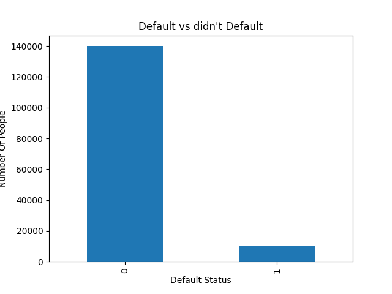
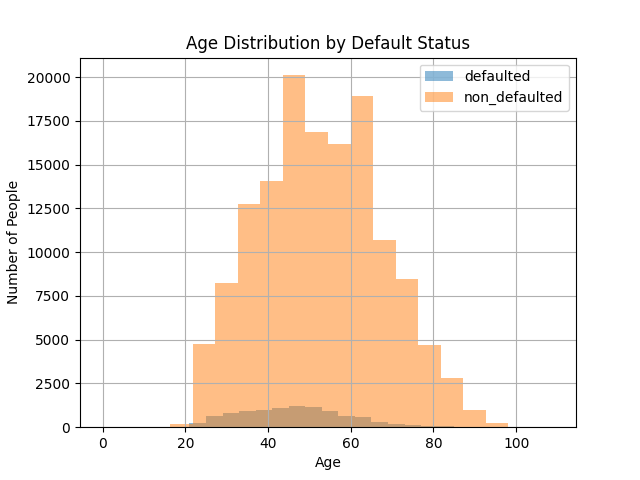
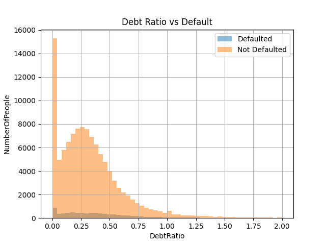
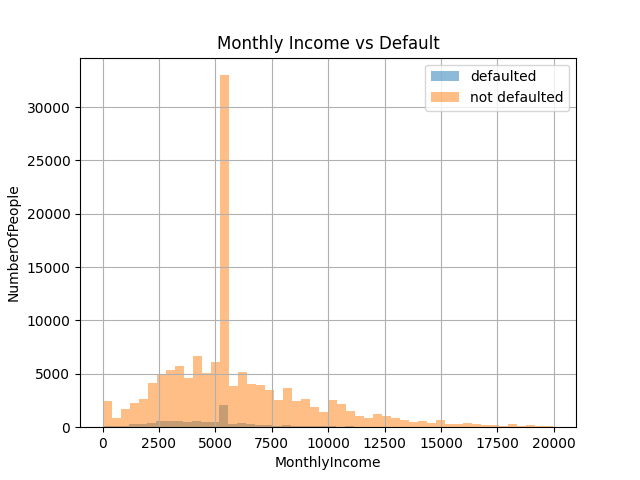
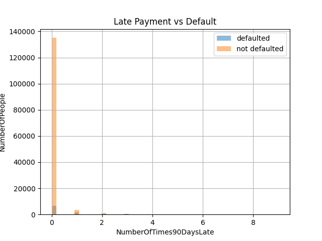

# Credit Risk EDA — Give Me Some Credit

## Project Overview
Exploratory data analysis on 150,000 real loan applicants to identify 
who is likely to default. Built as a multi-tool portfolio project 
using Python, SQL, and Power BI.

## Research Question
Do different analytical tools produce different insights on the same 
credit risk data?

## Dataset
- Source: Kaggle — Give Me Some Credit
- 150,000 rows, 11 features
- Target variable: SeriousDlqin2yrs (1 = defaulted, 0 = did not)

## Key Findings
- 93% of borrowers did not default — class imbalance problem identified
- Late payments (90+ days) is the strongest predictor of default
- Age, debt ratio and income alone are weak predictors
- Defaults peak in the 40-60 age group

## Tools Used
- Python (pandas, matplotlib) — EDA and data cleaning
- SQL — in progress
- Power BI — in progress

## Charts

## Predictive Modelling

Building on the EDA findings, two machine learning models were trained to predict 
credit default risk.

### Data Preprocessing
- Identified 29,265 missing income values
- Applied median imputation over mean due to right-skewed income distribution
- Mean would have overestimated typical income and distorted default risk assessment
- Applied StandardScaler before logistic regression to normalise feature ranges

### Logistic Regression
- ROC-AUC: 0.79
- Recall for defaulters: 0.65
- Precision for defaulters: 0.17
- Catches 65% of real defaulters with class_weight balanced
- Recommended for bank deployment due to interpretability and higher recall

### Random Forest
- ROC-AUC: 0.84
- Recall for defaulters: 0.37
- Precision for defaulters: 0.41
- Training recall: 1.00 vs Test recall: 0.37
- Severe overfitting detected — not suitable for deployment without further tuning

### Model Comparison and Key Insight
Random forest scores higher on ROC-AUC but misses more than half of actual 
defaulters. Logistic regression is the more reliable choice for a real bank 
deployment where missing a defaulter carries direct financial consequences.
A higher ROC-AUC does not automatically mean a better model when business 
context is considered.

## Research Extension
This project is the foundation of an ongoing research paper:
"Can Large Language Models Reliably Evaluate Data Analysis Quality? 
A Study Using Real Financial Data"
Targeting arXiv submission August 2026 under category q-fin.RM.
